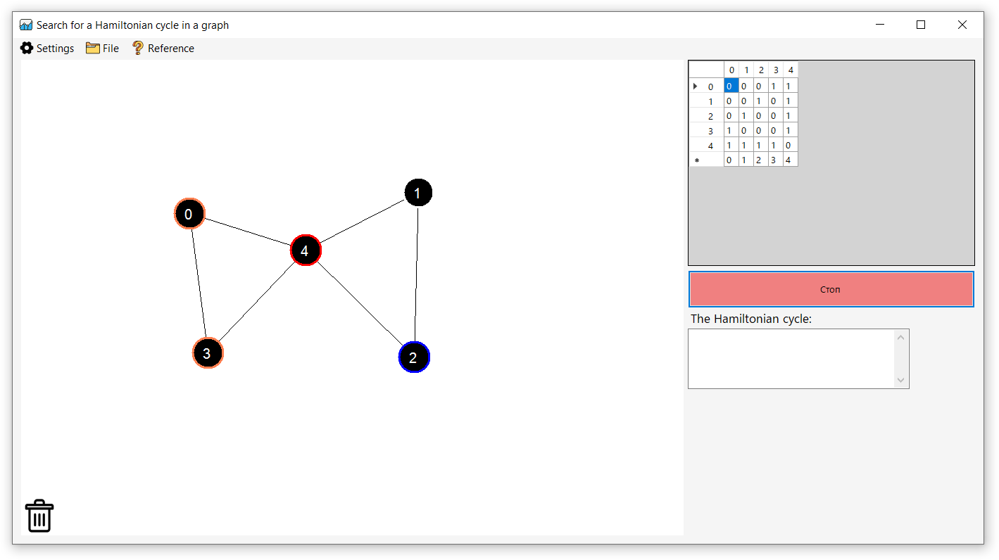

# Hamiltonian Cycle Search

## Overview

A desktop application built with **C++** and **WinForms** that allows users to visually construct graphs and find Hamiltonian cycles. The project features multi-language support, customizable themes, and user session management.

## ✨ Features

- 🧩 Graph creation with an intuitive GUI
- 🔄 Adjacency matrix generation
- 🔍 Hamiltonian cycle search algorithm
- 🌐 Multilingual interface (English, Belarusian, etc.)
- 🎨 Theme customization with a set of background images
- 💾 Graph saving and loading via `.gr` files
- 👤 User authentication and data storage

## 📁 Project Structure

- `courseWork/` — Main application source folder  
  - `*.h`, `*.cpp`, `*.resx` — Forms and UI logic  
  - `Backgrounds/` — Theme background images  
  - `Icon/` — Icons for visibility toggles and UI elements  
  - `Data/UserData/` — User-specific data storage  
  - `graph.gr` — Graph data file  
  - `graphClass.h`, `myVector.h` — Graph logic and data structures  
  - `Новая папка/` — Backup or draft folder with similar structure
- `assets/` — Images for documentation and presentation
- `README.md` — Project description
- `LICENSE.txt` — License information
- `.gitignore`, `Labs.sln` — Solution files

## 🧪 Technologies

- **C++** with **Windows API / WinForms**
- **Visual Studio solution (.sln)** structure
- **Resource localization files (.resx)** for internationalization

## 📜 License

This project is licensed under the [MIT License](LICENSE.txt).
